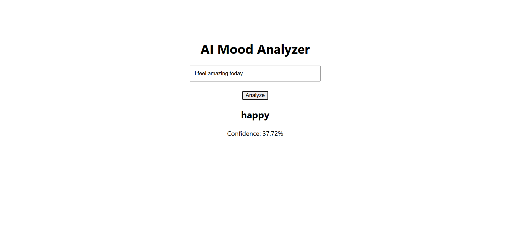

# 🧠 AI Mood Analyzer

A full-stack NLP application that classifies the mood expressed in user-provided text and returns a prediction with a confidence score.

The project demonstrates an end-to-end machine learning workflow, from text preprocessing and model inference to REST API integration and a deployed React interface.

🌐 **Live Application:** [ai-mood-analyzer.vercel.app](https://ai-mood-analyzer.vercel.app)

---

## 📸 Demo



---

## 🚀 Features

* Real-time text classification
* Mood prediction from natural-language input
* Prediction confidence scores
* REST API for model inference
* Responsive React interface
* Deployed frontend and backend architecture

---

## 🧠 How It Works

The application uses a traditional NLP classification pipeline:

1. The user enters a sentence in the React interface.
2. The frontend sends the text to the Flask API.
3. Text is transformed into numerical features using **TF-IDF**.
4. A trained **Logistic Regression** classifier predicts the most likely mood category.
5. The API returns the prediction and confidence score.
6. The result is displayed to the user in real time.

### Architecture

```text
User Input
    ↓
React Frontend
    ↓
Flask REST API
    ↓
TF-IDF Vectorization
    ↓
Logistic Regression Model
    ↓
Prediction + Confidence
    ↓
React UI
```

---

## 🛠️ Tech Stack

| Area                | Technology          |
| ------------------- | ------------------- |
| Machine Learning    | scikit-learn        |
| NLP                 | TF-IDF              |
| Classification      | Logistic Regression |
| Backend             | Python, Flask       |
| Frontend            | React, JavaScript   |
| API                 | REST                |
| Frontend Deployment | Vercel              |
| Backend Deployment  | Render              |

---

## 📂 Project Structure

```text
AI-MOOD-ANALYZER/
├── backend/
│   └── ...
├── frontend/
│   └── ...
├── demo.png
└── README.md
```

The project separates the machine-learning/API layer from the user interface, allowing the frontend and backend to be developed and deployed independently.

---

## 🔍 Machine Learning Approach

The classification pipeline uses **TF-IDF (Term Frequency–Inverse Document Frequency)** to transform text into numerical features.

A **Logistic Regression** classifier then learns relationships between those features and the mood categories represented in the training data.

This approach provides a lightweight and interpretable baseline for text classification while supporting fast inference in a web application.

---

## 💡 What I Learned

Building this project gave me hands-on experience with:

* Building an end-to-end NLP classification pipeline
* Transforming natural-language data with TF-IDF
* Training and using a scikit-learn classifier
* Serving ML predictions through a Flask REST API
* Connecting a React frontend to a Python backend
* Handling real-time API requests and responses
* Deploying a full-stack machine-learning application

---

## ⚠️ Limitations

Mood and emotion are subjective and highly dependent on context.

This application predicts categories based on patterns learned from its training data and should be treated as an experimental text-classification project rather than a system capable of determining a person's actual emotional state.

---

## 🚀 Run Locally

Clone the repository:

```bash
git clone https://github.com/hritika20002/AI-MOOD-ANALYZER.git
cd AI-MOOD-ANALYZER
```

Install the backend dependencies and start the Flask server from the `backend` directory.

Then install the frontend dependencies and start the React application from the `frontend` directory.

---

## 🌐 Live Demo

Try the deployed application:

**[Launch AI Mood Analyzer →](https://ai-mood-analyzer.vercel.app)**

---

## 👩‍💻 Author

**Hritika Sharma**

Computer Science Graduate · AI & Data Developer

[Portfolio](https://portfolio-pink-ten-96.vercel.app/) · [LinkedIn](https://www.linkedin.com/in/hritikasharma2002/)
